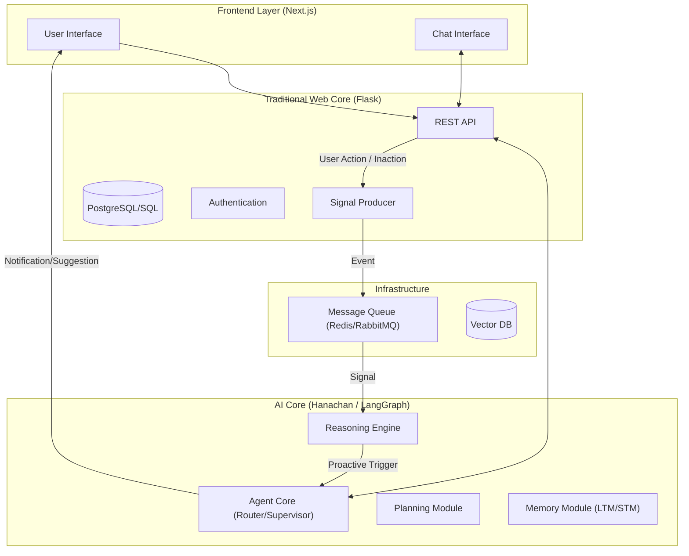

# Architectural Integration Plan: From "Messy Core" to "Cognitive Partner"

Based on the principles in *Building an AI-Integrated Goal Tracker*, this draft outlines the strategy to integrate the advanced agentic concepts into the current `hanabira.org` architecture (Flask Backend + Next.js Frontend + Hanachan AI Service).

## 1. Vision: The "Cognitive Partner" Architecture

The goal is to evolve the system from a **Passive Tool** (User inputs data -> App stores it) to an **Active Cognitive Partner** (App observes signals -> App reasons -> App proactively supports).

### High-Level Architecture

## 2. Component Integration

### A. The "Memory Module" (Foundation of Personalization)
**Current State**: likely ephemeral or simple conversation history in LangGraph checkpointer.
**Target State**: Hierarchical Memory.

*   **Action Items**:
    1.  **Implement `MemoryService`** in `backend/hanachan/services/memory.py`:
        *   **STM (Short-Term)**: Continue using LangGraph State/Checkpointer.
        *   **Episodic LTM**: Store significant user events (e.g., "Hit 7-day streak", "Failed math goal") in a Vector DB.
        *   **Semantic LTM**: Store user facts (e.g., "Prefers morning study", "Struggles with calculus") in a structured SQL/JSON store.
    2.  **Reflective Memory**: Add a "Reflection Node" in the `workflow_study_agent.py` that runs periodically (e.g., end of session) to summarize STM into LTM.

### B. The "Signals Layer" (Enabling Proactivity)
**Current State**: Reactive (Agent waits for user).
**Target State**: Proactive (Agent acts on environmental data).

*   **Action Items**:
    1.  **Signal Producers (Flask)**:
        *   Hook into Flask routes (e.g., `dashboard_routes.py` and `task_routes.py`).
        *   When a user completes a task -> Emit `TASK_COMPLETED` signal.
        *   Cron job -> Emit `DAILY_CHECKIN` signal if no activity by 8 PM.
    2.  **Signal Consumers (Hanachan)**:
        *   Create a background worker in Hanachan that listens to the Queue.
        *   On signal receipt, query **Memory Module**.
        *   **Reasoning**: "Is this signal actionable?" (e.g., User missed study time + has exam soon = Suggest specific study session).

### C. The "Tooling Interface" (Execution)
**Current State**: `workflow_study_agent.py` has some tools.
**Target State**: MCP-style or robust Function Calling.

*   **Action Items**:
    1.  **Expose Flask as Tools**:
        *   Hanachan needs "hands" to manipulate the "Web Core".
        *   Create internal API endpoints in Flask for the Agent:
            *   `POST /internal/api/habits/log`: Allow agent to log a habit for the user.
            *   `GET /internal/api/stats`: Allow agent to see user progress.
    2.  **Standardize Tools in Hanachan**:
        *   Define tools in `backend/hanachan/tools/` that wrap these API calls.

## 3. Implementation Plan (Draft)

### Phase 1: Solidify the "Brain" (Hanachan)
*   [ ] **Fix Memory Service**: Ensure `backend/hanachan/services/memory.py` is fully implemented with Vector DB support.
*   [ ] **Refactor Agent Workflow**: Update `workflow_study_agent.py` to query LTM before generating responses.

### Phase 2: Bridge the Cores (Flask <-> Hanachan)
*   [ ] **Internal API**: Securely expose User Data from Flask to Hanachan.
*   [ ] **Shared Auth**: Ensure Hanachan requests to Flask are authenticated (Service-to-Service).

### Phase 3: Activate the "Signals"
*   [ ] **Queue Setup**: Deploy Redis.
*   [ ] **Event Hooks**: Add event emission in Flask for key user actions.
*   [ ] **Proactive Workflow**: Create a specialized "Proactive Agent" workflow in Hanachan that takes a *Signal* as input (instead of a User Message).

## 4. Immediate Next Steps / Questions
*   The generic `services/memory.py` in Hanachan seems missing or empty. Shall we scaffold the **Hierarchical Memory** structure there?
*   Do we have a Vector DB (e.g., Chroma, Pinecone, pgvector) available or preferred?
*   Should we start by adding the "Reflection" step to the current `workflow_study_agent` to test LTM?
