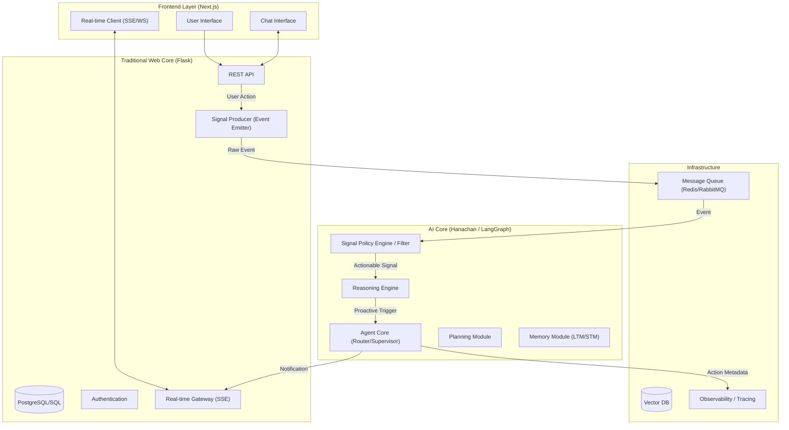

# Architectural Integration Plan: From "Messy Core" to "Cognitive Partner"

Based on the principles in *Building an AI-Integrated Goal Tracker*, this draft outlines the strategy to integrate the advanced agentic concepts into the current `hanabira.org` architecture (Flask Backend + Next.js Frontend + Hanachan AI Service).

## 1. Vision: The "Cognitive Partner" Architecture

The goal is to evolve the system from a **Passive Tool** (User inputs data -> App stores it) to an **Active Cognitive Partner** (App observes signals -> App reasons -> App proactively supports).

### High-Level Architecture (Revised v2)


## 2. Component Integration (Refined)

### A. The "Memory Module" & Observability
*   **Action Items**:
    1.  **Implement `MemoryService`** with layers: STM (LangGraph), Episodic LTM (Vector), Semantic LTM (SQL/JSON).
    2.  **Observability**: Implement decision logging to track *why* an agent intercepted a user.

### B. The "Signals Layer" & Policy Engine
*   **Critical Update**: Prevent "LLM Spam" and Infinite Loops.
*   **Action Items**:
    1.  **Signal Producer (Flask)**: Emits "Raw Events" only (e.g., `task.completed`, `streak.broken`). Strict separation from AI logic.
    2.  **Signal Policy Engine (Hanachan)**:
        *   **Deduplication**: Ignore identical signals within X minutes.
        *   **Heuristics**: `if user_status == 'busy': drop_signal`.
        *   **Loop Guard**: Check `correlation_id` to ensure this event wasn't caused by the agent itself.
    3.  **Real-time Gateway**: Use Server-Sent Events (SSE) in Flask to push Agent suggestions to Frontend without polling.

### C. Signal Taxonomy & Priority
**Rationale**: Not all signals are equal. A "Missed Habit" is different from a "User Clicked a Button".
*   **Priority Levels**:
    1.  **CRITICAL (P0)**: Immediate action required (e.g., User asks for help, Payment failure).
        *   *Action*: Bypass standard queues, wake up Agent immediately.
    2.  **HIGH (P1)**: Strong coaching opportunity (e.g., Broken Streak, Failed Quiz).
        *   *Action*: Process within <1 minute. Interrupt user if active.
    3.  **NORMAL (P2)**: Context update (e.g., Task completed, Logged in).
        *   *Action*: Asynchronous processing. Update LTM. Do not interrupt unless requested.
    4.  **BACKGROUND (P3)**: Data exhaust (e.g., Page views, scroll depth).
        *   *Action*: Batch process for long-term analytics only. No Agent trigger.

### D. The "Tooling Interface"
*   **Action Items**:
    1.  **Expose Flask as Tools**: `POST /internal/api/habits/log`, etc.
    2.  **Standardize Tools**: Wrap in `hana_tools`.

## 3. Use Case: Study Plan Orchestration

How the **Study Plan** (The "Ideal") interacts with **Signals** (The "Reality"):

| Scenario | Plan (Reference) | Signal (Reality) | Priority | Agent Action |
| :--- | :--- | :--- | :--- | :--- |
| **On Track** | "Study N5 Kanji daily" | `task.completed` (Kanji) | **P2 (Normal)** | **Update Memory**: "User is consistent." (No Notification) |
| **At Risk** | "Finish Chapter 1 by Friday" | `system.time_check` (Thursday 8PM) + `progress=0%` | **P1 (High)** | **Proactive Nudge**: "You're behind schedule. Want a quick 10-min session?" |
| **Crisis** | "Daily Streak: 30 Days" | `system.daily_reset` (23:55 PM) + `status=incomplete` | **P0 (Critical)** | **Urgent Alert**: "5 mins left to save your 30-day streak!" |
| **Burnout** | "Max 2 hours/day" | `app.usage` (> 4 hours) | **P1 (High)** | **Wellness Check**: "You've been working hard. Maybe take a break?" |

### Implementation Strategy
1.  **Plan Store**: Flask DB stores the static plan (Deadlines, Quotas).
2.  **Monitor**: A Background Worker (Celery/Cron) checks Plan vs. Actual every hour.
3.  **Divergence = Signal**: If `Actual < Plan`, emit a P1 Signal.

## 4. Detailed Implementation Roadmap

### Phase 1: The Brain (Memory & Logic)
**Objective**: Enable Hanachan to remember users and reason about them across sessions.

*   **Detailed Steps**:
    1.  **Memory Schema**: Design VectorSchema for episodic events and SQL/JSON schema for semantic facts.
    2.  **MemoryService**: Implement CRUD for `ShortTermMemory` (Redis/LangGraph) and `LongTermMemory` (VectorDB).
    3.  **Reflection Node**: Create a graph node that runs at session end to condense STM -> LTM.
    4.  **Retrieval Tool**: Enable the active agent to query LTM ("What did I do last week?").

*   **Checklist**:
    *   [ ] `MemoryService` class structure defined.
    *   [ ] Connection to Vector DB (e.g., Chroma/Pinecone) established.
    *   [ ] Reflection prompt engineered ("Summarize key insights...").
    *   [ ] Unit tests for Read/Write memory.

*   **Tests**:
    *   *Unit*: `test_memory_storage`: Write a fact, retrieve it.
    *   *Long Run*: `test_context_window_overflow`: Simulate 100 turns, verify summary node triggers and compresses context.

### Phase 2: The Nervous System (Signals & Policies)
**Objective**: Build the infrastructure for the "Body" (Web) to talk to the "Brain" (AI) without chaos.

*   **Detailed Steps**:
    1.  **Queue Setup**: Deploy Redis instance for `hana_signals` queue.
    2.  **Producer (Flask)**: Create `SignalEmitter` class in Flask. Hook into `complete_task` route.
    3.  **Consumer (Hanachan)**: Create a background worker (`Celery` or `asyncio` loop) to drain the queue.
    4.  **Policy Engine**: Implement the `SignalFilter` class with `deduplicate()` and `check_priority()` methods.

*   **Checklist**:
    *   [ ] Redis running in docker-compose.
    *   [ ] Flask emits JSON packet on route access.
    *   [ ] Hanachan worker prints received packet.
    *   [ ] Policy Engine drops duplicate packet sent within 5 seconds.

*   **Tests**:
    *   *Unit*: `test_signal_filtering`: Send critical vs. spam signals; assert only critical passes.
    *   *Coordinate Test*: Emit signal in Flask -> Verify log in Hanachan (End-to-End latency < 200ms).

### Phase 3: The Body (Real-time & Hooks)
**Objective**: Allow the Agent to "speak" to the user proactively.

*   **Detailed Steps**:
    1.  **SSE Endpoint**: Create `/api/stream/events` in Flask.
    2.  **Frontend Client**: Add `EventSource` listener in `ChatProvider`.
    3.  **Agent-to-SSE**: Connect Hanachan's output ("Notification") to Flask's SSE broadcaster.
    4.  **UI Components**: Build "Toast" or "suggestion bubble" for agent messages.

*   **Checklist**:
    *   [ ] Curl request to SSE endpoint receives keep-alive heartbeat.
    *   [ ] Triggering a mock agent event shows a generic toast on Frontend.
    *   [ ] "Do not disturb" mode toggle works in Frontend.

*   **Tests**:
    *   *Extended Coordinate Test*:
        1.  User enters "Focus Mode" (Flask state update).
        2.  System generates P2 signal.
        3.  Policy Engine blocks signal (Context Awareness).
        4.  User exits "Focus Mode".
        5.  System generates P1 signal.
        6.  User receives Toast notification.

### Phase 4: Full System Coordination (Vibe Check)
**Objective**: Tune the personality and timing.

*   **Detailed Steps**:
    1.  **Personality Tuning**: Ensure "Urgent" doesn't sound "Panic".
    2.  **Latency Optimization**: Ensure P0 signals process in < 2s.
    3.  **Dashboard**: Create an Admin View to see "Signal Traffic".

*   **Long-Run Stress Test**:
    *   Simulate 1,000 users emitting daily task signals.
    *   Monitor: Queue depth, LLM Token cost/minute, Error rate.
    *   *Pass Criteria*: Zero dropped P0 signals; Queue clears < 5s.

## 5. Observability Strategy: Tracing the Complex Flows
**Rationale**: With async queues and multi-agent loops, knowing "what happened" is impossible without structured tracing.

*   **Trace ID Standard (Correlation ID)**:
    *   Every Signal originates with a `trace_id` (UUID).
    *   This ID is passed: Flask `Emit` -> Queue `Payload` -> Hanachan `Context` -> Memory `Meta` -> Flask `SSE`.

*   **Key Trace Points (The "Life of a Signal")**:
    1.  `[FLASK][PRODUCER]`: `sig_emitted` {type: 'task', id: '123'}
    2.  `[QUEUE][BUS]`: `msg_enqueued` {latency: '5ms'}
    3.  `[HANA][FILTER]`: `sig_evaluated` {outcome: 'ACCEPTED' | 'DROPPED', reason: 'priority'}
    4.  `[HANA][AGENT]`: `reasoning_start` {prompt_tokens: 500}
    5.  `[HANA][ACTION]`: `tool_call` {tool: 'send_notification'}
    6.  `[FLASK][SSE]`: `push_sent` {client_ack: true}

*   **Logging Schema**:
    ```json
    {
      "timestamp": "ISO8601",
      "level": "INFO",
      "service": "hanachan",
      "trace_id": "uuid-v4",
      "user_id": "usr_123",
      "event": "signal_processed",
      "meta": { "priority": "P1", "cost": 0.02 }
    }
    ```

## 6. Next Steps / Questions
*   **Approval**: Do you want to start with Phase 1 (Memory) or Phase 2 (Infrastructure)?
*   **Vector DB**: Preference for locally hosted (Chroma) vs. Cloud (Pinecone)?
